# Collision Avoidance System - Track an Object in 3D Space
Finally, I finished this project!:notes: Many many thanks to Prof. Andreas Haja!

<p align = "center">
  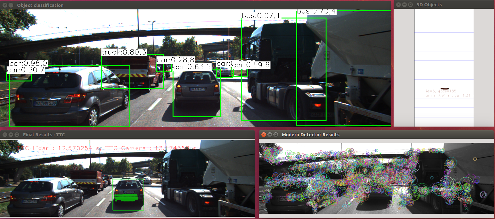
</p>

## Part I: Solution Description
### FP.1 Match 3D Objects

#### Criteria
Implement the method "matchBoundingBoxes", which takes as input both the previous and the current data frames and provides as output the ids of the matched regions of interest (the boxID property). Matches must be the ones with the highest number of keypoint correspondences.

#### Solution
So how to find the correspondences? This figure below illustrates a keypoint matching between previous and current camera data frames. As known here, there could be some mismatching in which the keypoint/descriptor on one object were wrongly matched with those looking-similar features on another object. But the majority of the keypoints matching are correct. Therefore we make use this fact to find the bounding box matching.

:blush::laughing:Forgive my bad drawing:laughing::blush:
<p align = "center">
  
</p>


_step1_
Iterate through all the boundingBox in the **_previous data frame_**, finding those keypoints located in this boundingBox area.

_step2_
For each keypoint found in the boundingBox, locate to which boundingBox its matched keypoint in **_current data frame_** belong.

_step3_
Storing the matching in a multimap(allows repetitive key value). Due to the mismatching fact, the possible result would be 

|   BoundingBox Id   |  keypoint index   |     
|       ---          |       ---         | 
|      Box-5         |      kPt_1        |
|      Box-5         |      kPt_2        | 
|      Box-5         |      kPt_3        |
|      Box-5         |      kPt_4        | 
|      Box-5         |      kPt_5        | 
|      Box-3         |      kPt_6        |
|      Box-4         |      kPt_7        | 
|      Box-4         |      kPt_8        | 

Note: The data is read from that figure above, the one Box-3 and two Box-4 is caused by that mismatching(<font color='blue'>Blue Line</font>) respectively.

_step4_
Everything is clear now, five keypoints fall into the Box-5, so Box-4 in previous data frame finds his sibling in the current data frame. we return [boxId_4, boxId_5].


**_Code_**
```
void matchBoundingBoxes(std::vector<cv::DMatch> &matches, std::map<int, int> &bbBestMatches, DataFrame &prevFrame, DataFrame &currFrame)
{
    for(auto it = prevFrame.boundingBoxes.begin(); it != prevFrame.boundingBoxes.end(); it++)
    {
        std::vector<vector<cv::DMatch>::iterator> enclose;
        for(auto it1 = matches.begin(); it1 != matches.end(); it1++) 
        {
            int prevKeyPointIdx = it1->queryIdx;
            if(it->roi.contains(prevFrame.keypoints.at(prevKeyPointIdx).pt)) 
            {
                enclose.push_back(it1);
            }
        }

        std::multimap<int, int> record;
        for(auto it2 = enclose.begin(); it2 != enclose.end(); it2++) {
            int currKeyPointIdx = (*it2)->trainIdx;
            for(auto it3 = currFrame.boundingBoxes.begin(); it3 != currFrame.boundingBoxes.end(); it3++)
            {
                if(it3->roi.contains(currFrame.keypoints.at(currKeyPointIdx).pt)) {
                    int boxId = it3->boxID;
                    record.insert(std::pair<int, int>(boxId, currKeyPointIdx));
                }
            }
        }

        int max = 0;
        int index = 10000;

        if(record.size() > 0) {
            for(auto it_4 = record.begin(); it_4 != record.end(); it_4++)
            {
                if(record.count(it_4->first) > max) {
                    max = record.count(it_4->first);
                    index = it_4->first;
                }  
            }
            bbBestMatches.insert(std::pair<int, int>(it->boxID, index));
        }
    }
}
```


### FP.2 Compute Lidar-based TTC
#### Criteria
Compute the time-to-collision in second for all matched 3D objects using only Lidar measurements from the matched bounding boxes between current and previous frame.

#### Solution
This vehicle is using a LiDAR to take distance measurements on preceding vehicles. The sensor in this scenario will give us the distance to the closest 3D point in the path of driving. 

<p align = "center">
  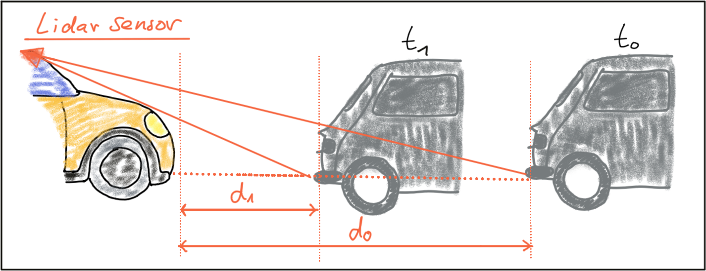
</p>

[Figure refers to Udacity]

The basic mathmatics for this function is intuitive and easy, in which we assume a model of constant-velocity.
<p align = "center">
  
</p>

[Figure refers to Udacity]


This image shows a LiDAR point cloud as an overlay over a camera image. And in the image below, Lidar points are shown in a top-view perspective.

<p align = "center">
  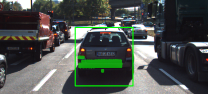
</p>


_LiDAR topview(figures below)_

<p float = "center">
    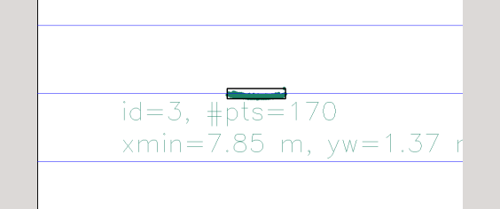 
    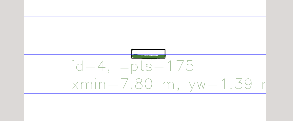
    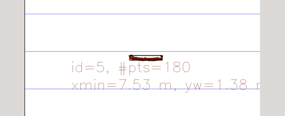
    
</p>

In order to compute the TTC, we need to find the distance to the closest LiDAR point in the path of driving. And if we zoom in, as shown in the figure below, a small number of points is located behind the tailgate, which seems like no connection to the vehicle, due to errorneous measurements occurred. When searching for the closest points, such measurements would pose a problem as the estimated distance will be too small.

<p align = "center">
  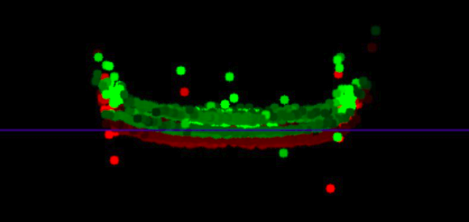
</p>

[This figure refers to Udacity]

In my implementation, in order to mitigate the some outliers in the horizontal direction, a threshold for Point.y value is setup to remove those points on the tailgate edge. Then, for the remaining points in the middle area, they are sorted in terms of the Point.x value, which is the driving path direction. Finally, the first closest_k_points are reserved and averaged to get the ultimate candidates as closest point.  

**_Code_**

```
void computeTTCLidar(std::vector<LidarPoint> &lidarPointsPrev,
                     std::vector<LidarPoint> &lidarPointsCurr, double frameRate, double &TTC)
{
 
    double laneWidth = 1.38;              // width of the preceding lidar area
    double yEdge = (laneWidth-0.2) / 2;

    auto checkFunc = [&yEdge](const LidarPoint &lp){return abs(lp.y) >= yEdge;};

    lidarPointsPrev.erase(std::remove_if(lidarPointsPrev.begin(), lidarPointsPrev.end(), checkFunc), 
                            lidarPointsPrev.end());

    lidarPointsCurr.erase(std::remove_if(lidarPointsCurr.begin(), lidarPointsCurr.end(), checkFunc), 
                            lidarPointsCurr.end());

    unsigned int closest_k_points = 50;

    // the given comparison function comp to construct a min heap
    auto comp = [](const LidarPoint &LP1, const LidarPoint &LP2){return LP1.x > LP2.x;};

    std::make_heap(lidarPointsPrev.begin(), lidarPointsPrev.end(), comp);
    std::sort_heap(lidarPointsPrev.begin(), lidarPointsPrev.begin() + closest_k_points, comp);

    std::make_heap(lidarPointsCurr.begin(), lidarPointsCurr.end(), comp);
    std::sort_heap(lidarPointsCurr.begin(), lidarPointsCurr.begin() + closest_k_points, comp);

    auto sumX = [](const double sum, const LidarPoint &LP) {return sum + LP.x;};
    double prevXMean = std::accumulate(lidarPointsPrev.begin(), lidarPointsPrev.begin()+closest_k_points, 0.0, sumX) / closest_k_points; 
    double currXMean = std::accumulate(lidarPointsCurr.begin(), lidarPointsCurr.begin()+closest_k_points, 0.0, sumX) / closest_k_points; 
    
    std::cout << "prevXmean is " << prevXMean << std::endl;
    std::cout << "currXmean is " << currXMean << std::endl;

    double dT = 1.0 / frameRate;
    TTC = currXMean * dT / (prevXMean - currXMean);
}
```

### FP.3 Associate Keypoint Correspondences with Bounding Boxes
#### Criteria
Prepare the TTC computation based on camera measurements by associating keypoint correspondences to the bounding boxes which enclose them. All matches which satisfy this condition must be added to a vector in the respective bounding box.


#### Solution
To find all associate robust keypoint correspondences with bounding boxes, after looping through and get all keypoints within one bounding box, a mean value of all the euclidean distances between keypoint matches is calculated, then re-iterate them to remove those that are too far away from the mean.

```
void clusterKptMatchesWithROI(BoundingBox &boundingBox, std::vector<cv::KeyPoint> &kptsPrev, std::vector<cv::KeyPoint> &kptsCurr, std::vector<cv::DMatch> &kptMatches)
{
    std::vector<double> euclideanDistance;
    for(auto it = kptMatches.begin(); it != kptMatches.end(); it++)
    {
        int currKptIndex = (*it).trainIdx;
        const auto &currKeyPoint = kptsCurr[currKptIndex];

        if(boundingBox.roi.contains(currKeyPoint.pt))
        {
            int prevKptIndex = (*it).queryIdx;
            const auto &prevKeyPoint = kptsPrev[prevKptIndex];

            euclideanDistance.push_back(cv::norm(currKeyPoint.pt - prevKeyPoint.pt));
        }
    }
    int pair_num =  euclideanDistance.size();
    double euclideanDistanceMean = std::accumulate(euclideanDistance.begin(), euclideanDistance.end(), 0.0) / pair_num;

    for(auto it = kptMatches.begin(); it != kptMatches.end(); it++)
    {
        int currKptIndex = (*it).trainIdx;
        const auto &currKeyPoint = kptsCurr[currKptIndex];

        if(boundingBox.roi.contains(currKeyPoint.pt))
        {
            int prevKptIndex = (*it).queryIdx;
            const auto &prevKeyPoint = kptsPrev[prevKptIndex];

            double temp = cv::norm(currKeyPoint.pt - prevKeyPoint.pt);

            double euclideanDistanceMean_Augment = euclideanDistanceMean * 1.3;
            if(temp < euclideanDistanceMean_Augment)
            {
                boundingBox.keypoints.push_back(currKeyPoint);
                boundingBox.kptMatches.push_back(*it);
            }
        }
    }
}
```

### FP.4 Compute Camera-based TTC
#### Criteria
Compute the time-to-collision in second for all matched 3D objects using only keypoint correspondences from the matched bounding boxes between current and previous frame.

#### Solution

As shown in the following figure, we can see how height _H_ of the preceding vehicle can be mapped into the image plane using perspective projection. It is obvious that there is a geometric relation between _h_, _H_, _d_ and the focal length _f_. And second figure shows this processing, thanks to Prof. Andreas Haja.:thumbsup::thumbsup::thumbsup:

<p align = "center">
  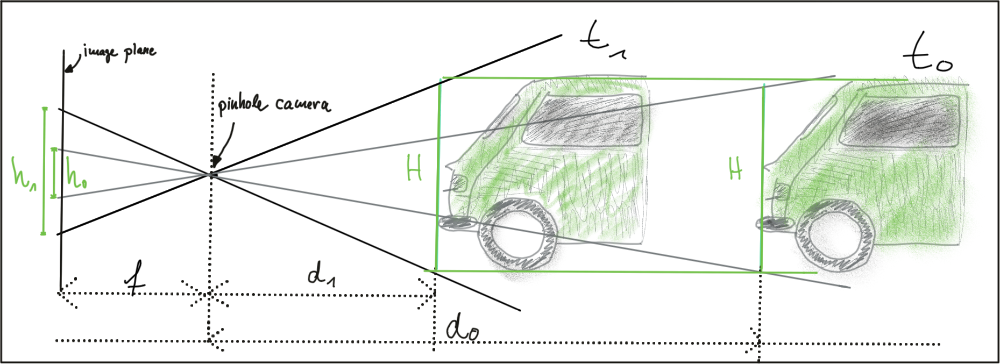
</p>

<p align = "center">
  
</p>

[Figures refers to Udacity]

Based on this inference, we could use the distance between all keypoints on the vehicle relative to each other to compute a robust estimate of the height ratio in TTC equation. The figures below illustrates this concept.

<p align = "center">
  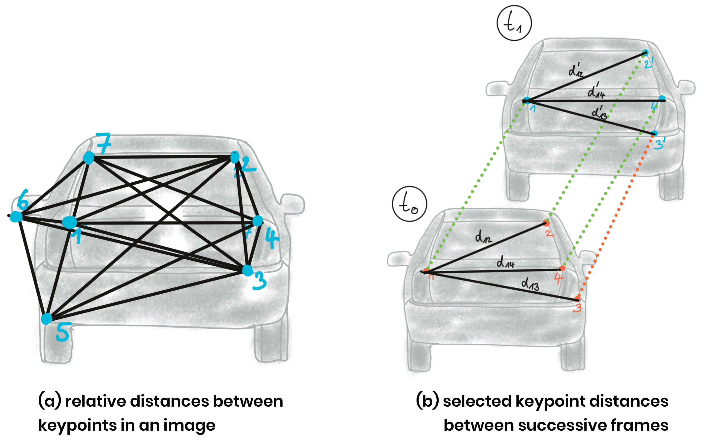
</p>

In (a), a set of keypoints has been detected and the relative distances between keypoints 1-7 have been computed. In (b), 4 keypoints have been matched between successive frames (with keypoint 3 being a mismatch). The ratio of all relative distances between each other can be used to compute a reliable TTC estimate by replacing the height ratio _h_1_ / _h_0_ with the mean or median of all distance ratios _d_k_ / _d_k'_. 

```
void computeTTCCamera(std::vector<cv::KeyPoint> &kptsPrev, std::vector<cv::KeyPoint> &kptsCurr, 
                      std::vector<cv::DMatch> kptMatches, double frameRate, double &TTC, cv::Mat *visImg)
{
    // compute distance ratios between all matched keypoints
    vector<double> distRatios; // stores the distance ratios for all keypoints between curr. and prev. frame
    for (auto it1 = kptMatches.begin(); it1 != kptMatches.end() - 1; ++it1)
    { 
        // get current keypoint and its matched partner in the prev. frame
        cv::KeyPoint kpOuterCurr = kptsCurr.at(it1->trainIdx);
        cv::KeyPoint kpOuterPrev = kptsPrev.at(it1->queryIdx);

        for (auto it2 = kptMatches.begin() + 1; it2 != kptMatches.end(); ++it2)
        { 
            double minDist = 90.0; // min. required distance default 100

            // get next keypoint and its matched partner in the prev. frame
            cv::KeyPoint kpInnerCurr = kptsCurr.at(it2->trainIdx);
            cv::KeyPoint kpInnerPrev = kptsPrev.at(it2->queryIdx);

            // compute distances and distance ratios
            double distCurr = cv::norm(kpOuterCurr.pt - kpInnerCurr.pt);
            double distPrev = cv::norm(kpOuterPrev.pt - kpInnerPrev.pt);

            if (distPrev > std::numeric_limits<double>::epsilon() && distCurr >= minDist)
            { 
                // avoid division by zero
                double distRatio = distCurr/distPrev;
                distRatios.push_back(distRatio);
            }
        } 
    }     

    // only continue if list of distance ratios is not empty
    if (distRatios.size() == 0)
    {
        TTC = NAN;
        return;
    }

    std::sort(distRatios.begin(), distRatios.end());
    long medIndex = floor(distRatios.size() / 2.0);

    double medDistRatio = distRatios.size() % 2 == 0 ? (distRatios[medIndex - 1] + distRatios[medIndex]) / 2.0 : distRatios[medIndex]; // compute median dist. ratio to remove outlier influence

    double dT = 1 / frameRate;
    TTC = -dT / (1 - medDistRatio);
}
```

## Part II: Performance Evaluation

### FP.5 Performance Evaluation 1
#### Criteria
Find examples where the TTC estimate of the Lidar sensor does not seem plausible. Describe your observations and provide a sound argumentation why you think this happened.

#### Solution
This three following figures give an implausible TTC estimate. As can be seen in this traffic scenario, there is actually a <font color='red'>Red</font> light in front and cars around are all braking. But the TTC estimate from LiDAR from this three successive frame incredibly increase from 13s to 33.7s then drop down to 15s.  

```
double dT = 1.0 / frameRate;
TTC = currXMean * dT / (prevXMean - currXMean);
```

##### Analysis:
As shown in the TTC calculation formular above, I can argue that this drastic change in TTC is caused by the a smaller interval(prevXMean - currXMean) than the one in last sampling. That is, the prevXMean, shortest distance to preceding car from previous data frame, might have been influenced by some point cloud outliers, resulting in shorter distance than the actual tailgate. 

##### Trial and Error:
In the **FP.2 Compute Lidar-based TTC** part, the _closest_k_points_ is set to 50, which means take the first 50 closest LiDAR points then calculate their mean value as the closest point. Now in order to mitigate the interference of the outlier, increase this value to 150 to see what would happen. I find this time, that 33s decrease down to 22s, which is a good sign and validate my guess.


<p align = "center">
  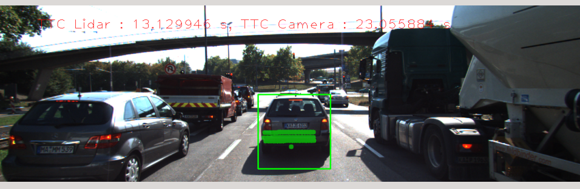
</p>

<p align = "center">
  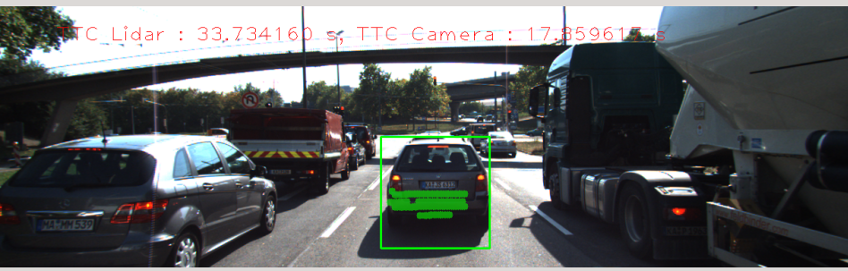
</p>

<p align = "center">
  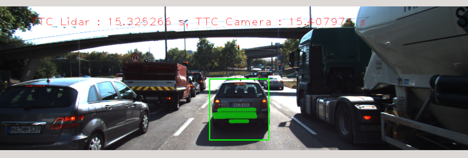
</p>


### FP.6 Performance Evaluation 2
#### Criteria
Run several detector/descriptor combinations and look at the differences in TTC estimation. Find out which methods perform best and also include several examples where camera-based TTC estimation is way off. As with Lidar, describe your observations again and also look into potential reasons.

#### Solution

|     Place      |            Combination                     | 
|  ------------  |           -------------                    |
|   1st place    | BRISK + BRIEF  (if prefer higher accuracy )| 
|   2nd place    | FAST + BRIEF   (if prefer speed)                     |    
|   3nd place    | BRISK + BRISK  (accuracy and speed are average level)| 

In the mid-term project, the top 3 detector/descriptor has been seletected in terms of their performance on accuracy and speed. So here, we use them one by one for Camera TTC estimate.

As seen in the following statistics, there is an _-inf_ value in FAST+BRIEF. And for BRISK+BRIEF, many Camera TTC estimates are way off the LiDAR measurements. For BRISK+BRISK, they are fantastic, excpt one or two TTC estimates are longer than LiDAR's.

##### Analysis:

The _-inf_ is supposed from this lines of code. The list of distance ratios is not empty, it may because the distribution of keypoints don't satisfy distance threshold.

```
if (distRatios.size() == 0)
{
    TTC = NAN;
    return;
}
```

##### BRISK + BRIEF

|     LiDAR TTC      |    Camera TTC       | 
|        ---         |       ---           |
|      12.57s        |     14.7s           | 
|       12.2s        |     23.8s           |     
|        22s         |       18s           |
|        14s         |       23s           |
|      14.2s         |       27s           |
|       14s          |       54s           |
|     13.7s          |       25s           |
|      13.4s         |       18s           |
|      12s           |       20s           |
|      13s           |       18s           |
|      13.3s         |       21s           |
|      11.6s         |       17s           |
|      8.9s          |     17.6s           |
|        9s          |     14.6s           |
|      8.7s          |       11s           | 
|        9s          |       15s           | 
|       15s          |       14s           | 
|       12s          |       17s           | 

<br>


##### FAST + BRIEF

|     LiDAR TTC      |    Camera TTC       | 
|        ---         |       ---           |
|      12.57s        |    11.2s            | 
|       12.2s        |      13s            |     
|         22s        |      15s            |
|       14.3s        |    13.8s            |
|       14.2s        |   **_-inf_** s      |
|       14s          |      24s            |
|      13.7s         |    12.5s            |
|      13.4s         |    12.6s            |
|      12s           |      14s            |
|      13s           |      15s            |
|      13.3s         |    13.8s            |
|      11.6s         |    12.7s            |
|      8.8s          |      12s            |
|        9s          |      11s            |
|      8.7s          |      12s            | 
|        9s          |    12.6s            | 
|       15s          |      11s            | 
|       12s          |       8s            | 

<br>

##### BRISK + BRISK

|     LiDAR TTC      |    Camera TTC       | 
|        ---         |       ---           |
|      12.57s        |    13.2s            | 
|       12.2s        |      23s            |     
|         22s        |      17s            |
|       14.3s        |    15.4s            |
|       14.2s        |      29s            |
|       14s          |      18s            |
|      13.7s         |      17s            |
|      13.4s         |      22s            |
|      12s           |      15s            |
|      13s           |    13.4s            |
|      13.3s         |    12.8s            |
|      11.6s         |    11.2s            |
|      8.8s          |    11.8s            |
|        9s          |    11.8s            |
|      8.7s          |      16s            | 
|        9s          |      11s            | 
|       15s          |       9s            | 
|       12s          |      11s            | 


