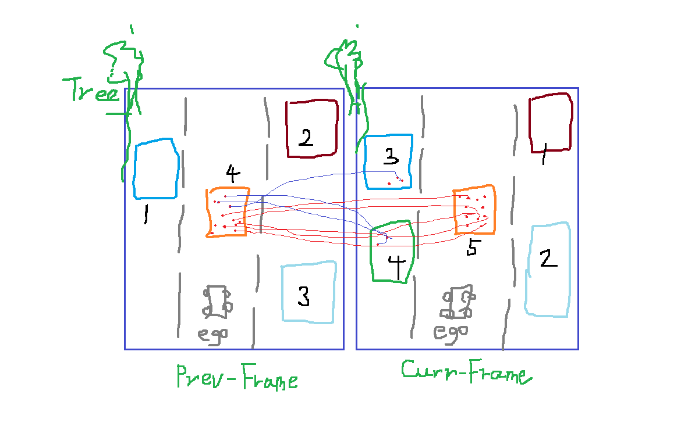

# Collision Avoidance System - Track an Object in 3D Space

## Part I: Solution Description
### FP.1 Match 3D Objects

#### Criteria
Implement the method "matchBoundingBoxes", which takes as input both the previous and the current data frames and provides as output the ids of the matched regions of interest (the boxID property). Matches must be the ones with the highest number of keypoint correspondences.

#### Solution
So how to find the correspondences? This figure below illustrates a keypoint matching between previous and current camera data frames. As known here, there could be some mismatching in which the keypoint/descriptor on one object were wrongly matched with those looking-similar features on another object. But the majority of the keypoints matching are correct. Therefore we make use this fact to find the bounding box matching.

<p align = "center">
  
</p>

_step1_
Iterate through all the boundingBox in the **_previous data frame_**, finding those keypoints located in this boundingBox area.

_step2_
For each keypoint found in the boundingBox, locate to which boundingBox its matched keypoint in **_current data frame_** belong.

_step3_
Storing the matching in a multimap(allows repetitive key value). Due to the mismatching fact, the possible result would be 

|   BoundingBox Id   |  keypoint index   |     
|       ---          |       ---         | 
|      Box-5         |      kPt_1        |
|      Box-5         |      kPt_2        | 
|      Box-5         |      kPt_3        |
|      Box-5         |      kPt_4        | 
|      Box-5         |      kPt_5        | 
|      Box-3         |      kPt_6        |
|      Box-4         |      kPt_7        | 
|      Box-4         |      kPt_8        | 

Note: The data is read from that figure above, the one Box-3 and two Box-4 is caused by that mismatching(Blue Line) respectively.

_step4_
Everything is clear now, five keypoints fall into the Box-5, so Box-4 in previous data frame finds his sibling in the current data frame. we return [boxId_4, boxId_5].


**_Code_**
```
void matchBoundingBoxes(std::vector<cv::DMatch> &matches, std::map<int, int> &bbBestMatches, DataFrame &prevFrame, DataFrame &currFrame)
{
    for(auto it = prevFrame.boundingBoxes.begin(); it != prevFrame.boundingBoxes.end(); it++)
    {
        std::vector<vector<cv::DMatch>::iterator> enclose;
        for(auto it1 = matches.begin(); it1 != matches.end(); it1++) 
        {
            int prevKeyPointIdx = it1->queryIdx;
            if(it->roi.contains(prevFrame.keypoints.at(prevKeyPointIdx).pt)) 
            {
                enclose.push_back(it1);
            }
        }

        std::multimap<int, int> record;
        for(auto it2 = enclose.begin(); it2 != enclose.end(); it2++) {
            int currKeyPointIdx = (*it2)->trainIdx;
            for(auto it3 = currFrame.boundingBoxes.begin(); it3 != currFrame.boundingBoxes.end(); it3++)
            {
                if(it3->roi.contains(currFrame.keypoints.at(currKeyPointIdx).pt)) {
                    int boxId = it3->boxID;
                    record.insert(std::pair<int, int>(boxId, currKeyPointIdx));
                }
            }
        }

        int max = 0;
        int index = 10000;

        if(record.size() > 0) {
            for(auto it_4 = record.begin(); it_4 != record.end(); it_4++)
            {
                if(record.count(it_4->first) > max) {
                    max = record.count(it_4->first);
                    index = it_4->first;
                }  
            }
            bbBestMatches.insert(std::pair<int, int>(it->boxID, index));
        }
    }
}
```


### FP.2 Compute Lidar-based TTC
#### Criteria
Compute the time-to-collision in second for all matched 3D objects using only Lidar measurements from the matched bounding boxes between current and previous frame.

#### Solution


### FP.3 Associate Keypoint Correspondences with Bounding Boxes
#### Criteria
Prepare the TTC computation based on camera measurements by associating keypoint correspondences to the bounding boxes which enclose them. All matches which satisfy this condition must be added to a vector in the respective bounding box.
#### Solution


### FP.4 Compute Camera-based TTC
#### Criteria
Compute the time-to-collision in second for all matched 3D objects using only keypoint correspondences from the matched bounding boxes between current and previous frame.

#### Solution


## Part II: Performance Evaluation

### FP.5 Performance Evaluation 1
#### Criteria
Find examples where the TTC estimate of the Lidar sensor does not seem plausible. Describe your observations and provide a sound argumentation why you think this happened.
#### Solution


### FP.6 Performance Evaluation 2
#### Criteria
Run several detector / descriptor combinations and look at the differences in TTC estimation. Find out which methods perform best and also include several examples where camera-based TTC estimation is way off. As with Lidar, describe your observations again and also look into potential reasons.
#### Solution